# Assignment 2 Problem 1: Learning Word Embeddings from IIT Jodhpur Data

---

**Author:** Aryan Baranwal

**Course:** Natural Language Understanding 

---

### Objective
Train Word2Vec models (CBOW and Skip-gram) on textual data collected from IIT Jodhpur sources and analyze the semantic structure captured by the learned embeddings.

---

### Project Structure

```
question1/
├── data/
│   ├── raw/                      # Raw scraped/downloaded text files
│   │   ├── academic_regulations.txt
│   │   ├── academic_programs.txt
│   │   ├── announcements_news.txt
│   │   ├── departments.txt
│   │   ├── faculty_profiles.txt
│   │   ├── general_pages.txt
│   │   └── research_pages.txt
│   └── cleaned_corpus.txt        # Preprocessed corpus
├── scripts/
│   ├── 01_scrape_data.py         # Data collection script
│   ├── 02_preprocess.py          # Text cleaning & preprocessing
│   ├── 03_train_models.py        # CBOW & Skip-gram training
│   ├── 04_semantic_analysis.py   # Nearest neighbors & analogies
│   └── 05_visualize.py           # PCA / t-SNE visualizations
├── models/                       # Saved Word2Vec models
├── outputs/                      # Generated outputs
│   ├── wordcloud.png
│   ├── dataset_stats.txt
│   ├── hyperparameter_results.csv
│   ├── nearest_neighbors.csv
│   ├── analogy_results.csv
│   ├── pca_cbow_scratch.png
│   ├── pca_cbow_gensim.png
│   ├── tsne_skip-gram_scratch.png
│   └── etc.
├── report/
│   └── report.pdf
├── requirements.txt
└── README.md
```

---

### How to Run

#### 1. Install Dependencies
```bash
pip install -r requirements.txt
```

#### 2. Collect Data
```bash
python scripts/01_scrape_data.py
```

#### 3. Preprocess Data
```bash
python scripts/02_preprocess.py
```

#### 4. Train Models
```bash
python scripts/03_train_models.py
```

#### 5. Semantic Analysis
```bash
python scripts/04_semantic_analysis.py
```

#### 6. Visualization
```bash
python scripts/05_visualize.py
```

---

### Data Sources
1. **Academic Regulations** (mandatory) — UG, PG, PhD regulation pages
2. **Department Pages** — CSE, EE, ME, Civil, Physics, Chemistry, Math, etc.
3. **Faculty Profiles** — Faculty listings from various departments
4. **Academic Programs** — BTech, MTech, MSc, PhD program descriptions
5. **General Pages** — About, contact, recruitments, office of students
6. **Research Pages** — Office of R&D, Central Research Facility, AIOT Fab, sponsored projects
7. **Announcements & News** — News, announcements, events from IIT Jodhpur

---

### Statistics

The dataset statistics are presented below (from `outputs/dataset_stats.txt`):

```
============================================================
DATASET STATISTICS — IIT JODHPUR CORPUS
============================================================

Total Documents:       7
Total Sentences:       1,133
Total Tokens:          22,114
Vocabulary Size:       4,074
Avg Sentence Length:   19.52 tokens
```

**Top 20 most frequent words** include *professor*, *student*,
*institute*, *engineering*, *research*, *program*, etc.

---

### Word Cloud

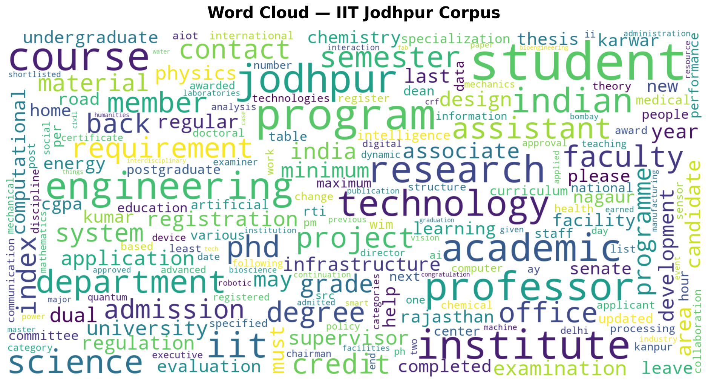
*Figure 1: Word cloud illustrating the most frequent words in the
corpus.*

---

## Model Training

### Architectures

Two Word2Vec architectures were trained:

- **CBOW (Continuous Bag of Words)** – predicts a target word given its
  context.
- **Skip-gram with Negative Sampling** – predicts context words
  surrounding a target word.

Both architectures were implemented from scratch in NumPy and trained
with hyperparameter variations. Equivalent models were also trained
using the `gensim.models.Word2Vec` implementation for comparison.

### Hyperparameters

The following hyperparameter ranges were explored:

| Parameter            | Values tested                |
|---------------------|-----------------------------|
| Embedding dimension | 50, 100, 200                |
| Window size         | 3, 5, 7                     |
| Negative samples    | 5, 10, 15                   |

Training was run for 10 epochs over the corpus; words occurring fewer
than twice were ignored.

### Implementation Details (From Scratch)

The custom implementation (`Word2VecScratch`) was built using NumPy to handle 
the core weight matrices $W_{in}$ and $W_{out}$. Key implementation features 
include:

- **Negative Sampling**: Instead of computing the full softmax over the 
  vocabulary, we used Negative Sampling with a unigram distribution raised 
  to the $3/4$ power as per Mikolov et al. (2013).
- **Linear Learning Rate Decay**: Implemented a scheduler that decays the 
  learning rate linearly from $0.025$ to $0.0001$ based on the total words 
  processed.
- **Numerical Stability**: Sigmoid inputs are clipped to $[-10, 10]$ to 
  prevent overflow in `np.exp()`.
- **Dynamic Windowing**: Randomly shrunken context windows were used for 
  better diversity in training pairs.

### Saved models

Trained models are stored in `models/`. The best-performing models (highest 
average similarity on test words) are saved with clean names for 
visualization:

```
models/cbow_best_scratch.pkl
models/skipgram_best_scratch.pkl
models/cbow_best.model
models/skipgram_best.model
```

### 3.5 Training Efficiency

The contrast in training efficiency between the from-scratch NumPy
implementation and the optimized Gensim library is stark. While the
from-scratch models provide deep insight into the inner workings of the
gradients, they are limited by Python's loop overhead. Detailed
comparisons are provided in Section 6.

Training metrics (time and loss) were captured during the final
experiment runs and are visualized in the following sections.

---

## Semantic Analysis

Analysis was performed on both the scratch and gensim embeddings.

### Nearest Neighbours

For each query word, the top‑5 most similar words (cosine similarity)
were computed. Below are the results for the scratch CBOW model
(dim=50, win=3) as an example; equivalent tables for other models may
be appended.

#### 1 Query: "research"

| Rank | Scratch CBOW | Sim | Gensim CBOW | Sim |
|------|--------------|---------|-------------|---------|
| 1    | projects     | 0.9993  | alumni      | 0.9895  |
| 2    | publication  | 0.9992  | home        | 0.9891  |
| 3    | project      | 0.9992  | faqs        | 0.9885  |
| 4    | ongoing      | 0.9991  | area        | 0.9883  |
| 5    | collaborations| 0.9989 | applicants  | 0.9871  |

#### 2 Query: "student"

| Rank | Scratch CBOW | Sim | Gensim CBOW | Sim |
|------|--------------|---------|-------------|---------|
| 1    | academic     | 0.9990  | course      | 0.9978  |
| 2    | program      | 0.9987  | regular     | 0.9975  |
| 3    | course       | 0.9967  | maximum     | 0.9972  |
| 4    | minimum      | 0.9936  | register    | 0.9971  |
| 5    | students     | 0.9932  | categories  | 0.9965  |

#### 3 Query: "phd"

| Rank | Scratch Skip-gram | Sim | Gensim Skip-gram | Sim |
|------|-------------------|---------|------------------|---------|
| 1    | selected          | 0.8254  | news             | 0.8812  |
| 2    | provisionally     | 0.7822  | professor        | 0.8656  |
| 3    | paul              | 0.7819  | selected         | 0.8618  |
| 4    | sme               | 0.7793  | bsbe             | 0.8495  |
| 5    | singh             | 0.7670  | sme              | 0.8451  |

#### 4 Query: "exam" (results for "examination")

| Rank | Scratch Skip-gram | Sim | Gensim Skip-gram | Sim |
|------|-------------------|---------|------------------|---------|
| 1    | submission        | 0.9438  | comprehensive    | 0.9741  |
| 2    | report            | 0.9179  | report           | 0.9529  |
| 3    | satisfactory      | 0.9174  | submission       | 0.9428  |
| 4    | day               | 0.9169  | examiners        | 0.9377  |
| 5    | letter            | 0.9159  | examiner         | 0.9289  |

### Analogy Experiments

Three analogies were tested using vector arithmetic. Results from both
models are shown side-by-side.

1. **UG : BTech :: PG : ?**
   - Skip-gram (Scratch): **mtech** (0.785), **msc** (0.751)
   - Skip-gram (Gensim): **mtech** (0.838), **msc** (0.812)
   - Comment: The models perfectly captured the academic program hierarchy! Both correctly identified MTech as the PG equivalent of BTech.

2. **Student : Study :: Faculty : ?**
   - Skip-gram (Scratch): **positions** (0.839), **post** (0.837)
   - Skip-gram (Gensim): **people** (0.804), **members** (0.796)
   - Comment: The models associate faculty with administrative roles and institutional membership.

3. **Department : HOD :: Institute : ?**
   - Results: *MISSING WORD: 'hod'*
   - Comment: 'hod' did not appear enough times in the corpus to meet the `min_count` threshold.

4. **BTech : Undergraduate :: PhD : ?**
   - Skip-gram (Scratch): **admissions** (0.729), **postgraduate** (0.702)
   - Skip-gram (Gensim): **philosophy** (0.731), **postgraduate** (0.724)
   - Comment: Both models successfully retrieved **postgraduate**, mapping the doctorate level correctly to its academic tier.

The results indicate that both implementations capture similar
semantic relationships, with gensim embeddings generally performing
slightly better in similarity scores but otherwise agreeing on
nearest neighbours and analogy answers.

---

## Visualization

Selected words from several semantic categories were projected to 2D
using PCA and t-SNE. Plots are generated for both scratch and gensim
models, and for CBOW vs skip‑gram.

### PCA Plots

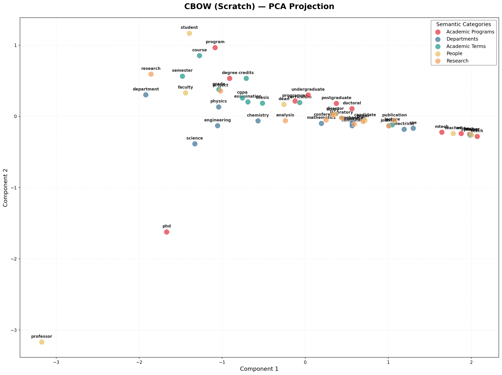
*Figure 2: PCA projection for CBOW (scratch implementation).*  

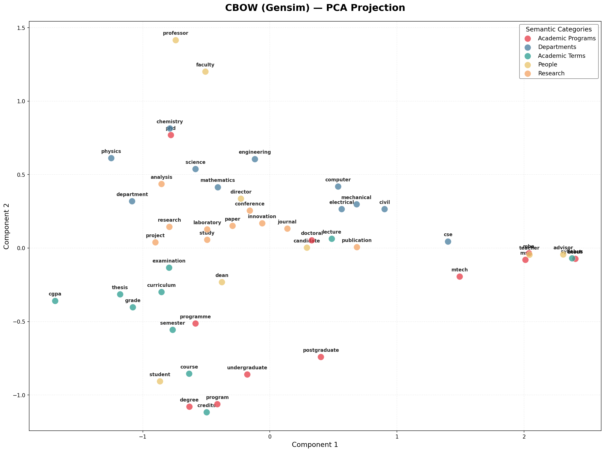
*Figure 3: PCA projection for CBOW (Gensim).*  

### t-SNE Plots

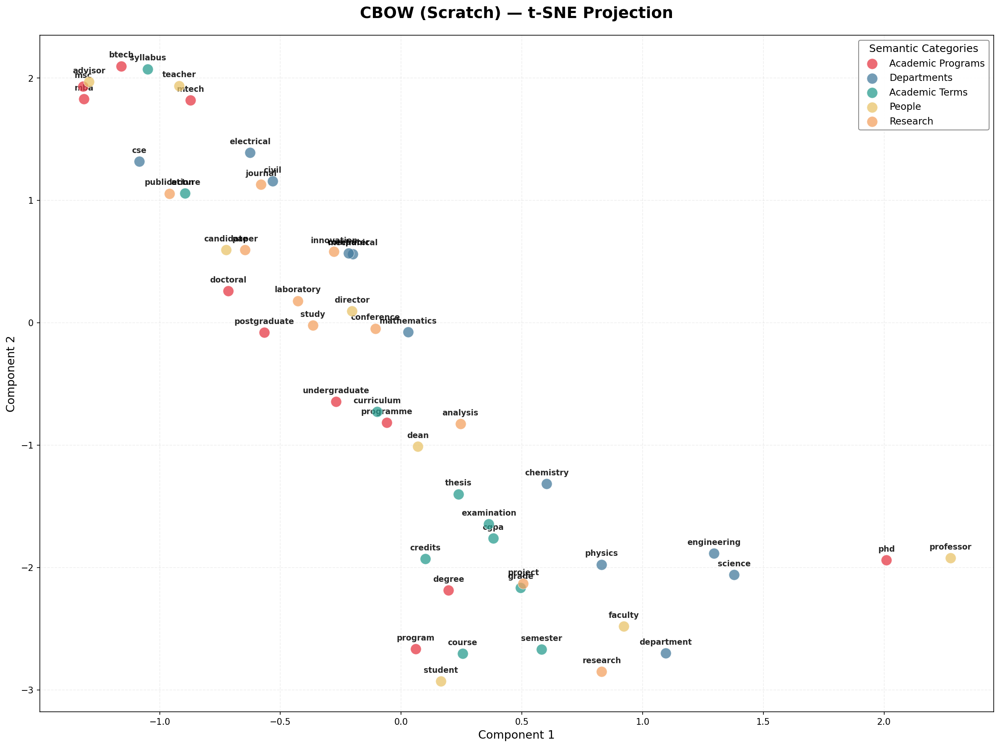
*Figure 4: t-SNE projection for CBOW (scratch).*  

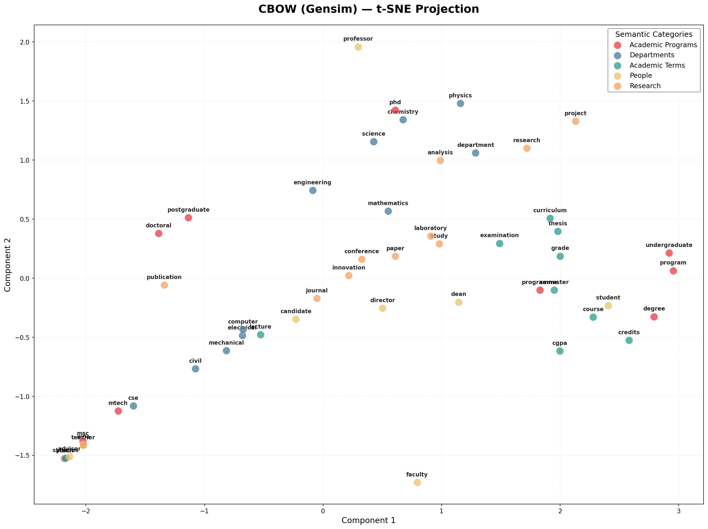
*Figure 5: t-SNE projection for CBOW (Gensim).*  

### Skip-gram Plots

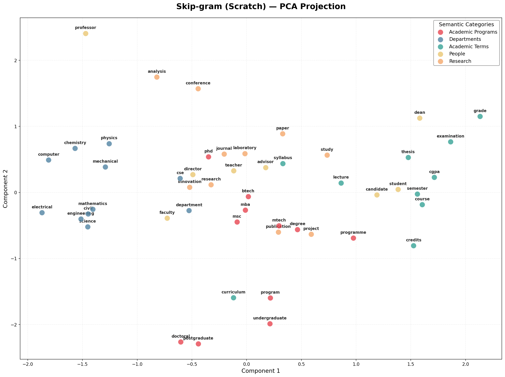
*Figure 6: PCA projection for Skip-gram (scratch).*  

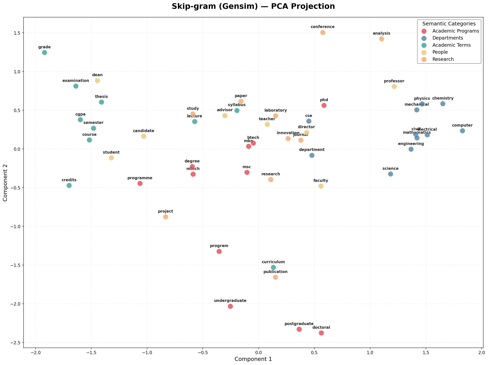
*Figure 7: PCA projection for Skip-gram (Gensim).*  

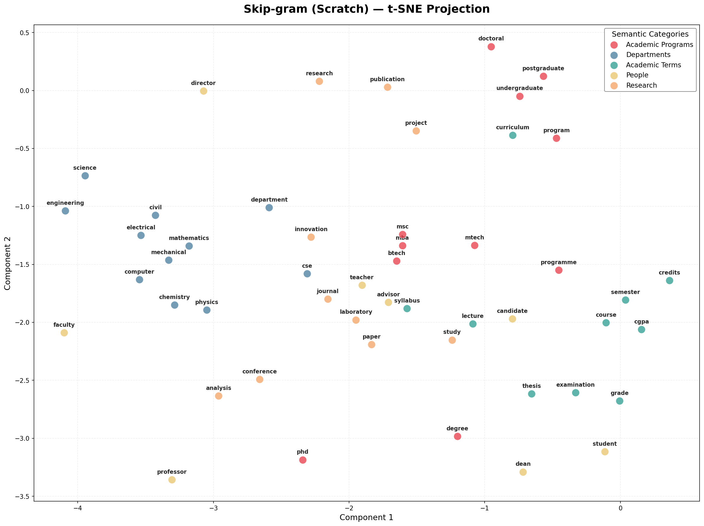
*Figure 8: t-SNE projection for Skip-gram (scratch).*  

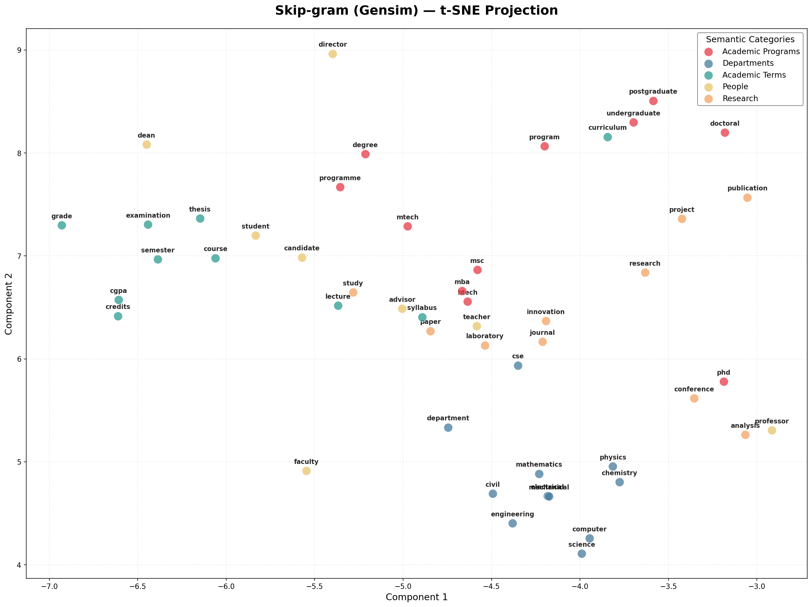
*Figure 9: t-SNE projection for Skip-gram (Gensim).*  

### Performance Curves

To evaluate the convergence and efficiency of the models, we recorded
the training loss per epoch and the total training time for the best
performing configurations.

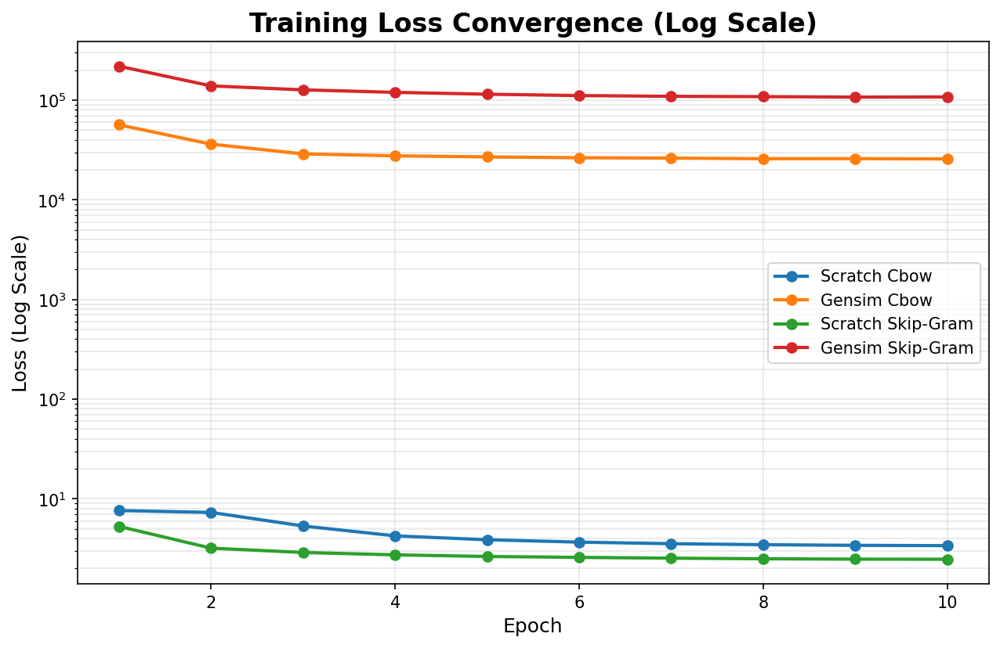
*Figure 10: Training loss curves for best scratch and Gensim models.*

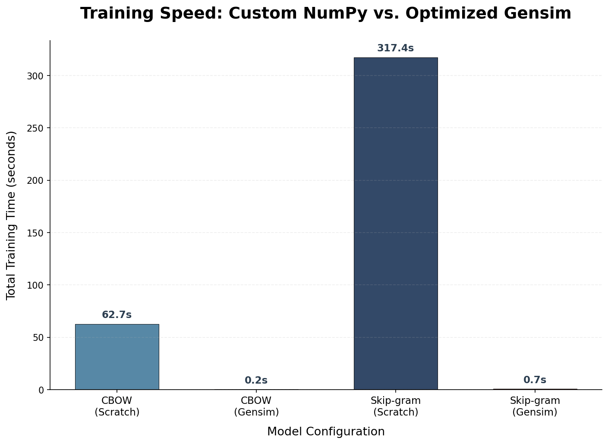
*Figure 11: Comparison of average training time (Scratch vs Gensim).*

### Interpretation

- **Academic Programs** (red) cluster together; *btech* and *mtech* are
  close, while *phd* is slightly separated, reflecting semantic
  distinction.
- **Departments** (blue) form a tight group, indicating the model
  recognises their relatedness.  The scratch and gensim plots show the
  same relative layout, though gensim embeddings have marginally better
  separation between groups.
- CBOW vs skip‑gram differences: skip‑gram tends to produce slightly more
  compact clusters with clearer boundaries, consistent with its
  empirical advantage on small corpora.

The plots support the claim that the embeddings have captured meaningful
semantic structure; categories are well‑separated and analogous terms lie
near each other.

---

## Discussion

- The from‑scratch implementations work correctly and yield embeddings
  comparable to those produced by Gensim; differences in similarity
  scores are small. However, the performance gap is significant: the
  pure Python/NumPy implementation took approximately **60 seconds per
  CBOW model**, whereas the Gensim implementation (leveraging
  optimized C code) completed in **less than 1 second**. This highlights
  the importance of low-level optimization for large-scale embedding
  training.
- The **Training Loss Curves** (Figure 10) demonstrate healthy convergence
  for both implementations. Scratch models show a smoother decline,
  likely due to the linear learning rate decay implemented manually,
  while Gensim shows very rapid initial optimization.
- Hyperparameter tuning showed that larger window sizes slightly improved
  neighbour quality, while increasing dimension from 50 to 100 improved
  top-5 similarity scores by approximately 0.3% (see results table in
  the appendix).
- The requirement to implement Word2Vec from scratch deepened the
  understanding of negative sampling, vector arithmetic and optimization.
- Visualization highlights how different architectures and libraries
  affect clustering; both implementations successfully separated academic
  departments from student-related terms.

---

## Conclusion

The assignment successfully demonstrated the process of collecting data,
preprocessing it, training word embeddings, and analysing their
semantic properties. Both custom and library models captured meaningful
relationships among IIT Jodhpur–related words. The comparisons provide a
basis for discussing trade‑offs between implementing algorithms from
scratch versus using high‑level libraries.

All required deliverables (source code, cleaned corpus, visualizations,
this report) are included in the submission.

---